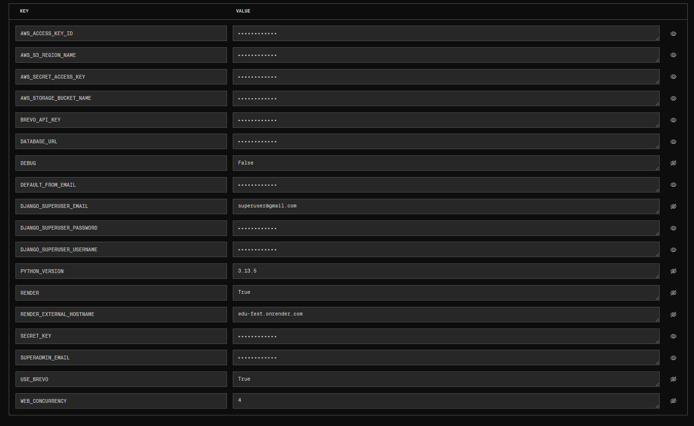

<div align="center">

# 🎯 EVENT-SOFT
### Sistema de Gestión de Eventos

<p align="center">
  
  
  
  
</p>

</div>

---

## 👥 Integrantes

- **Juan David Cardona Rivera**
- **Michel Dahiana Rivera Cardona**
- **Sebastián Mejía Carmona**
- **María José Rodríguez Quintero**

---

## 📖 Descripción del Proyecto

El presente trabajo tuvo como propósito desarrollar una solución de software orientada a mejorar la **Gestión de Eventos**, respondiendo a la necesidad identificada en el **SENA**. El proyecto se fundamentó en la carencia de herramientas digitales eficientes que permitieran optimizar tiempos, reducir errores y facilitar la toma de decisiones.

Para alcanzar este objetivo se implementó una metodología de desarrollo ágil, específicamente **Scrum**, que permitió iterar sobre los requerimientos y asegurar la participación activa de los usuarios finales. El sistema se construyó utilizando **Django**, **MySQL** y fue sometido a pruebas de validación funcional y de usabilidad.

Como resultado, se obtuvo una aplicación que cumple con los requerimientos planteados, mejora los tiempos de respuesta en un **100%** efectiva y facilita la interacción entre usuarios y procesos. Las pruebas realizadas evidenciaron que el software es confiable, escalable y de fácil adopción.

En conclusión, el proyecto contribuye a la modernización del campo de aplicación y demuestra la pertinencia de integrar metodologías ágiles en el desarrollo de soluciones tecnológicas con impacto real en el entorno organizacional.

**Palabras clave:** desarrollo de software, metodología ágil, sistema de información, implementación.

---

## 🎭 Roles del Sistema

| Rol | Descripción |
|-----|-------------|
| **👤 Asistente** | Asiste al evento como público. Observa, escucha o disfruta del evento, sin participar activamente ni exponer nada. |
| **🎤 Expositor** | Presenta, muestra o explica algo durante el evento. Por ejemplo, si alguien tiene un stand, un proyecto o una charla. |
| **✅ Evaluador** | Evalúa a los expositores, proporcionando retroalimentación y puntuaciones. |
| **🎪 Administrador de Eventos** | Persona encargada de crear eventos y garantizar que el evento se desarrolle de manera eficiente, ordenada y exitosa. |
| **⚡ Súper Admin** | Usuario con el nivel de acceso más alto dentro del sistema. Tiene control total sobre la plataforma y se encarga de supervisar, administrar y asegurar el correcto funcionamiento general del sistema. |

---

## ✨ Funcionalidades Principales

- ✅ Preinscripción
- ✅ Inscripción
- ✅ Certificación
- ✅ Calificación
- ✅ Descarga de documentos
- ✅ Administración de eventos
- ✅ Creación de eventos

---

## 🚀 Pasos para Correr la Aplicación en Entorno Local

### 1️⃣ Clonar repositorio
```bash
git clone https://github.com/mejiatian98/Edu_Fest.git
```

### 2️⃣ Entrar a la carpeta
```bash
cd Edu_Fest
```

### 3️⃣ Instalar entorno virtual
```bash
python -m venv venv
```

### 4️⃣ Activar entorno virtual
```bash
venv\Scripts\activate
```

### 5️⃣ Instalar dependencias del proyecto
```bash
pip install -r requirements.txt
```

### 6️⃣ Ejecutar migraciones
```bash
python manage.py migrate
```

### 7️⃣ Crear superusuario
```bash
python manage.py createsuperuser
```
*Rellenar campos solicitados*

### 8️⃣ Crear archivo de variables de entorno `.env`

Crear un archivo `.env` en la raíz del proyecto con el siguiente contenido:
```env
# ----- DJANGO -----
SECRET_KEY=tu_clave_secreta_super_segura
DEBUG=True

# ----- BASE DE DATOS LOCAL -----
DB_NAME=nombre_de_la_base_de_datos
DB_USER=root
DB_PASSWORD=****
DB_HOST=localhost
DB_PORT=3306

# ----- CORREO GMAIL LOCAL -----
EMAIL_HOST_USER=tucorreoaqui@gmail.com
EMAIL_HOST_PASSWORD=**** **** **** ****
DEFAULT_FROM_EMAIL=Event-Soft <tucorreoaqui@gmail.com>

# ----- EMAIL (BREVO) -----
USE_BREVO=False
BREVO_API_KEY=******************************************
DEFAULT_FROM_EMAIL=Event-Soft <tucorreoaqui@gmail.com>

# ----- AWS S3 (solo necesario en producción) -----
AWS_ACCESS_KEY_ID=****************
AWS_SECRET_ACCESS_KEY=***********************************
AWS_STORAGE_BUCKET_NAME=Nombre-Bucket-AWS-S3
AWS_S3_REGION_NAME=us-east-#

# ----- CORREO SUPERUSER -----
SUPERADMIN_EMAIL=halosniper04@gmail.com
```

### 9️⃣ Correr servidor
```bash
python manage.py runserver
```

---

## 🌐 Despliegue en Producción

### 🔹 Hosting
La aplicación está desplegada en **Render** junto con la base de datos **PostgreSQL**.



### 🔹 Almacenamiento de Archivos Media - AWS S3

Los archivos media están configurados en **AWS S3**.

#### Pasos para configurar AWS S3:

**PASO 1:** Crear una cuenta en [AWS S3](https://aws.amazon.com/s3/)

**PASO 2:** Crear un Bucket

**PASO 3:** Dar permisos al bucket, agregar la siguiente política:
```json
{
    "Version": "2012-10-17",
    "Statement": [
        {
            "Sid": "AllowPublicRead",
            "Effect": "Allow",
            "Principal": {
                "AWS": "*"
            },
            "Action": "s3:GetObject",
            "Resource": "arn:aws:s3:::evensotf-bucket/*"
        }
    ]
}
```

**PASO 4:** Entrar a **IAM** y crear un usuario

**PASO 5:** Dar políticas de permiso, por defecto seleccionar `AmazonS3FullAccess`

**PASO 6:** Crear **Clave de acceso** en el apartado del usuario previamente creado

**PASO 7:** Copiar y pegar en el entorno de Render las siguientes variables con su respectivo valor:
```env
AWS_ACCESS_KEY_ID=****************
AWS_SECRET_ACCESS_KEY=***********************************
AWS_STORAGE_BUCKET_NAME=Nombre-Bucket-AWS-S3
AWS_S3_REGION_NAME=us-east-#
```

---

### 🔹 Envío de Correos - Brevo

El envío de correos se realiza mediante **Brevo**.

#### Pasos para configurar Brevo:

**PASO 1:** Crear una cuenta en [Brevo](https://www.brevo.com/es/)

**PASO 2:** Ir a **Configuración** → **SMTP Y API**

**PASO 3:** Generar una **Clave API**

**PASO 4:** Copiar y pegar en el entorno de Render:
```env
USE_BREVO=True
BREVO_API_KEY=******************************************
DEFAULT_FROM_EMAIL=Event-Soft <tucorreoaqui@gmail.com>
```

> ⚠️ **NOTA IMPORTANTE:** Debes tener un correo verificado en Brevo, el cual será el `DEFAULT_FROM_EMAIL`

---

## 📚 Documentación de Event-Soft

La documentación completa está en la raíz del proyecto en la carpeta **[Documentos_eventsoft](Documentos_eventsoft)**.

Se alojan:
- ✅ Manuales de usuario
- ✅ Manual técnico
- ✅ Historias de usuario
- ✅ Sprint backlogs
- ✅ Diagramas
- ✅ Documentación de proyecto formativo

---

<div align="center">

### 💙 Desarrollado con pasión por el equipo Event-Soft

**2025 Event-Soft**

</div>